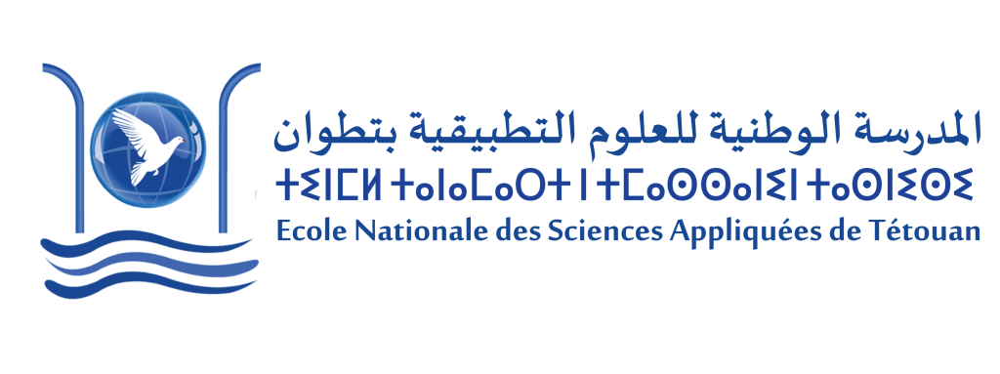
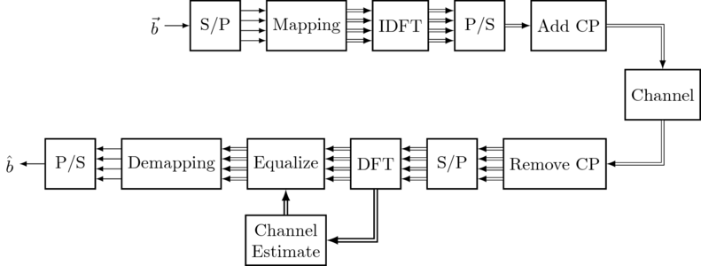

# [Python] Mise en place d'une chaîne de communication digitale - OFDM

Dans ce projet, nous allons explorer les bases d'un système OFDM du côté émission et réception. L'OFDM (multiplexage par répartition orthogonale de la fréquence) est un système multicarrier largement utilisé dans diverses transmissions sans fil comme LTE, WiMAX, DVB-T et DAB. Le principe clé d'un système multicarrier implique la division d'un flux de données à haut débit en plusieurs sous-porteuses étroites à débit réduit.

## Cette approche présente plusieurs avantages :

1. La durée du symbole étant inversement proportionnelle au débit de symboles, chaque sous-porteuse présente des symboles relativement longs. Ces symboles prolongés sont résistants aux problèmes tels que l'affaiblissement par trajets multiples, courant dans les systèmes sans fil.

2. En cas d'atténuation sévère d'une porteuse spécifique due aux caractéristiques sélectives en fréquence du canal (entraînant une réception très faible sur cette porteuse), seules les données de cette sous-porteuse sont perdues, et non la totalité du flux de données.

3. Les systèmes multicarriers facilitent l'allocation efficace des ressources entre plusieurs utilisateurs en attribuant différentes sous-porteuses à différents utilisateurs.
Veuillez considérer le schéma en blocs suivant, qui englobe les blocs fondamentaux du système OFDM :



## Aperçu :
Ce cahier Jupyter offre une exploration approfondie du système de multiplexage par répartition orthogonale de la fréquence (OFDM), couvrant ses composants fondamentaux, ses opérations et ses avantages. Le cahier examine à la fois les aspects de l'émetteur et du récepteur d'OFDM, en mettant en lumière son application dans divers systèmes de communication sans fil tels que LTE, WiMAX, DVB-T et DAB.

## Code Blocks :
- Composants de l'émetteur :
   - Génération des sous-porteuses
     ```python
     K = 64 # number of OFDM subcarriers
     CP = K//4  # length of the cyclic prefix: 25% of the block
     P = 8 # number of pilot carriers per OFDM block
     pilotValue = 3+3j # The known value each pilot transmits
     allCarriers = np.arange(K)  # indices of all subcarriers ([0, 1, ... K-1])
      
     pilotCarriers = allCarriers[::K//P] # Pilots is every (K/P)th carrier.
      
     # For convenience of channel estimation, let's make the last carriers also be a pilot
     pilotCarriers = np.hstack([pilotCarriers, np.array([allCarriers[-1]])])
     P = P+1 
      
     # data carriers are all remaining carriers
     dataCarriers = np.delete(allCarriers, pilotCarriers)
     ```
   - Mappage des données aux sous-porteuses
     ```python
     def Mapping(bits):
        return np.array([mapping_table[tuple(b)] for b in bits])
     QAM = Mapping(bits_SP)
     print ("First 5 QAM symbols and bits:")
     print (bits_SP[:5,:])
     print (QAM[:5])
     ```
   - Insertion des porteuses pilotes
     ```python
     def OFDM_symbol(QAM_payload):
        symbol = np.zeros(K, dtype=complex) # the overall K subcarriers
        symbol[pilotCarriers] = pilotValue  # allocate the pilot subcarriers 
        symbol[dataCarriers] = QAM_payload  # allocate the pilot subcarriers
        return symbol
     OFDM_data = OFDM_symbol(QAM)
     print ("Number of OFDM carriers in frequency domain: ", len(OFDM_data))
     ```
      - Transformée de Fourier inverse rapide (IFFT)
     ```python
     def IDFT(OFDM_data):
        return np.fft.ifft(OFDM_data)
     OFDM_time = IDFT(OFDM_data)
     print ("Number of OFDM samples in time-domain before CP: ", len(OFDM_time))
     ``` 
   - Ajout de préfixe cyclique
     ```python
     def addCP(OFDM_time):
        cp = OFDM_time[-CP:]               # take the last CP samples ...
        return np.hstack([cp, OFDM_time])  # ... and add them to the beginning
     OFDM_withCP = addCP(OFDM_time)
     print ("Number of OFDM samples in time domain with CP: ", len(OFDM_withCP))
     ```    
   - Transmission du signal
     ```python
     def channel(signal):
        convolved = np.convolve(signal, channelResponse)
        signal_power = np.mean(abs(convolved**2))
        sigma2 = signal_power * 10**(-SNRdb/10)  # calculate noise power based on signal power and SNR
    
        print ("RX Signal power: %.4f. Noise power: %.4f" % (signal_power, sigma2))
    
        # Generate complex noise with given variance
        noise = np.sqrt(sigma2/2) * (np.random.randn(*convolved.shape)+1j*np.random.randn(*convolved.shape))
        return convolved + noise
     OFDM_TX = OFDM_withCP
     OFDM_RX = channel(OFDM_TX)
     ```
- Composants du récepteur :
   - Réception du signal
   - Suppression du préfixe cyclique
     ```python
     def removeCP(signal):
        return signal[CP:(CP+K)]
     OFDM_RX_noCP = removeCP(OFDM_RX)
     ```
   - Transformée de Fourier rapide (FFT)
     ```python
     def DFT(OFDM_RX):
        return np.fft.fft(OFDM_RX)
     OFDM_demod = DFT(OFDM_RX_noCP)
     ```
   - Démappage des sous-porteuses
     ```python
     def Demapping(QAM):
        # array of possible constellation points
        constellation = np.array([x for x in demapping_table.keys()])
    
        # calculate distance of each RX point to each possible point
        dists = abs(QAM.reshape((-1,1)) - constellation.reshape((1,-1)))
    
        # for each element in QAM, choose the index in constellation 
        # that belongs to the nearest constellation point
        const_index = dists.argmin(axis=1)
    
        # get back the real constellation point
        hardDecision = constellation[const_index]
    
        # transform the constellation point into the bit groups
        return np.vstack([demapping_table[C] for C in hardDecision]), hardDecision
     ```
   - Estimation du canal à l'aide des porteuses pilotes
     ```python
     def channelEstimate(OFDM_demod):
        pilots = OFDM_demod[pilotCarriers]  # extract the pilot values from the RX signal
        Hest_at_pilots = pilots / pilotValue # divide by the transmitted pilot values
    
        # Perform interpolation between the pilot carriers to get an estimate
        # of the channel in the data carriers. Here, we interpolate absolute value and phase 
        # separately
        Hest_abs = scipy.interpolate.interp1d(pilotCarriers, abs(Hest_at_pilots), kind='linear')(allCarriers)
        Hest_phase = scipy.interpolate.interp1d(pilotCarriers, np.angle(Hest_at_pilots), kind='linear')(allCarriers)
        Hest = Hest_abs * np.exp(1j*Hest_phase)
    
        plt.plot(allCarriers, abs(H_exact), label='Correct Channel')
        plt.stem(pilotCarriers, abs(Hest_at_pilots), label='Pilot estimates')
        plt.plot(allCarriers, abs(Hest), label='Estimated channel via interpolation')
        plt.grid(True); plt.xlabel('Carrier index'); plt.ylabel('$|H(f)|$'); plt.legend(fontsize=10)
        plt.ylim(0,2)
    
        return Hest
     ```
   - Récupération des données
     ```python
     def PS(bits):
        return bits.reshape((-1,))
     bits_est = PS(PS_est)
     ```
     

## Bibliothèques utilisées :
- NumPy
- Matplotlib
- Scipy

## Instructions d'exécution :
1. Assurez-vous que toutes les bibliothèques requises sont installées.
2. Exécutez les cellules dans l'ordre séquentiel.
3. Vérifiez les sorties et visualisations aux sections pertinentes.

## Utilisation :
Ce cahier sert de ressource pédagogique pour comprendre les blocs de base d'un système OFDM. Il peut être utilisé à des fins d'apprentissage, d'expérimentation avec différents paramètres et pour acquérir des informations sur le fonctionnement d'OFDM.

## Remerciements :
- Un sincère remerciement au **Professeur Fouad Aytouna** pour ses précieuses contributions, conseils et soutien tout au long.
## Informations sur l'auteur :
- Nom : **[Redouane Benarif]**
- Contact : **[redouanebenarif@gmail.com]**
- Date de création : **[26-12-2023]**
